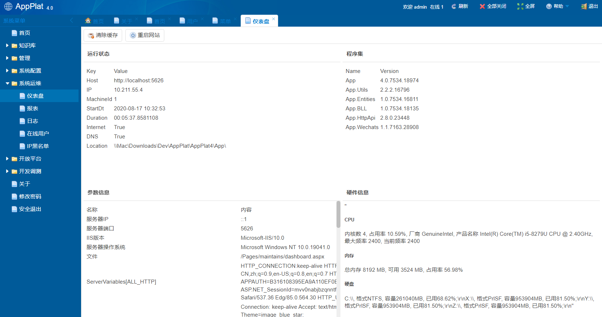

# AppPlat 快速开发平台 V4

https://github.com/surfsky/AppPlat4
surfsky
2020-08-17

# 1.功能

- [x] 基础平台：
  - [x] 用户、角色、权限、组织、部门、头衔、菜单、区域
  - [x] 登录、后台、欢迎页
  - [x] 网站参数配置
  - [x] 网页权限管理
- [x] 客户端对接
  - [x] 微信对接
  - [x] 钉钉对接
  - [x] 阿里云对接
- [x] 快速后台开发平台
  - [x] 快速数据访问层搭建
  - [x] 快速表格控件开发
  - [x] 快速列表及检索页开发
  - [x] 快速表单页开发
  - [x] 数据模型管理
  - [x] 数据字典管理
  - [x] 序列号管理
- [x] 网站管理平台
  - [x] 网站数据管理后台（基于 EF 自动生成、带导入导出功能）
  - [x] 路由管理：记录在数据库中，可动态调整
  - [x] IP黑名单管理
  - [x] 日志系统
  - [x] 性能监控
  - [x] 仪表盘
  - [x] 在线人员
- [x] 快速接口平台
  - [x] 融合 HttpApi 框架
  - [x] 自动将服务器端方法映射为接口
  - [x] 自动将服务器端方法映射为客户端js
  - [x] 自动生成接口测试页面
  - [x] 支持接口的缓存、授权、防攻击等能力
- [ ] 内容管理系统
  - [x] 内容编辑
  - [x] 数据库路由
  - [x] 大文件上传
  - [ ] **拖拽编辑响应式页面**
  - [ ] 内容模板系统
- [x] 文章管理
  - [x] 文章目录管理
  - [x] 文章检索
  - [x] 文章详情
  - [x] 文章评论及管理
  - [x] 文章访问管理
  - [x] 文章点赞
  - [x] 文章自动过期
  - [x] 文章编辑能力
    - [x] 支持文本、图片混排
    - [x] 支持插入视频
    - [ ] 支持视频预览: https://storage.googleapis.com/coverr-main/mp4/Mt_Baker.mp4
    - [x] 支持导出文章片段json，拆分文本、图片、视频，便于客户端排版
    - [x] 支持图片黏贴直接上传
    - [x] 支持 word 内容直接黏贴，遇到图片会直接上传
  - [x] 文章附件
    - [x] 可控上传附件类型及尺寸
    - [x] 支持大文件上传
    - [x] 图片类型自动生成缩略图
    - [x] Office 类型附件可打水印
- [x] 开放平台
  - [x] 接入APP管理
  - [x] OAuth 开放平台
  - [x] OpenID 方案
- [x] 安全防护体系
  - [x] 数据层采用 Entityframework，不直接操作SQL，避免SQL注入
  - [x] 系统采用Page-User-Role-Power 四级机制控制访问权限，避免越权访问
  - [x] URL 采用限时签名机制，阻止用户直接输入url进入
  - [x] API 采用Token、Login、Role、IP 等组合机制，避免无授权、无登陆、无角色、限制IP的非法访问
- [ ] 工作流系统
    - [x] 工作流跳转及限制
    - [x] 基于枚举及权限的工作流步骤
    - [x] 页面控制
    - [ ] 工作流事件
    - [ ] 用数据库存储
    - [ ] 用表格调整流程
    - [ ] 用界面拖动调整流程
    - [ ] 关联表单
- [ ] 消息队列框架
    - [x] 业务消息推送
    - [x] 长连接
    - [ ] 即时消息
    - [ ] 客服系统
- [ ] 缓存系统
  - [x] 单机模式 Caching
  - [ ] 分布式缓存系统
  - [ ] API相同，仅需修改配置
- [ ] 企业门户
  - [x] 单点登录接口（就是/HttpApi/User/Login)
  - [ ] 子系统集成展示
- [ ] 插件系统
  - [x] 实体模型
  - [x] 页面
  - [x] 数据接口
  - [x] 数据初始化及清理修正
  - [ ] 安装和卸载
- [ ] 规划
  - [ ] 跨平台方案。Asp.net core 版本，可迁移到 Linux 平台
  - [ ] 融合MVC（适合做前台） & WebForm（适合做后台）

# 2.Snap


管理


站点配置


站点运维



开发


开放平台


# 3.项目架构

项目相关
- App             Asp.net 网站
- App.BLL         业务相关类库
- App.Monitor     后台调度及监控

辅助类库
- App.Web         网站渲染引擎
- App.Utils        公共通用类库
- App.Office      Office 功能封装类库（不提供源码）
- App.Schedule    调度引擎
- App.HttpApi     Http 数据接口引擎

```

                     App                         App.Monitor
                      |                               |
     -----------------------------------      ------------------
     |                |                |      |                |
App.HttpApi      App.Web          App.BLL/App.Office       App.Schedule   
                      |                   |                    |
                      ------------------------------------------
                                          |
                                      App.Utils
```


# 4.数据访问层

本系统采用EntityFramework EntityBase&lt;T&gt; 方案，可快速有效的减少 DAL 层代码量。该方案内置以下逻辑：

- CRUD
- Transaction
- SnowflakeID方案
- CacheAll
- Tree
- History: 操作历史
- Log
- 附件
- 级联删除

## 4.1 基础示例

``` csharp
// 实体类
public class User : EntityBase<User>
{
    public int? Age {get; set;}
}

// 使用
var user = new User();   // 新建
var user = User.Get(5);  // 获取
user.Age = 20; 
user.Save();             // 保存(SaveNew or Update)
user.Delete();           // 删除
```

## 4.2 扩展

- 表 ID字段默认采用snowflakeId 分布式方法生成（long 64位长整形）。该算法中用到的 machineId 请在webconfig中配置，如：
     ```
    <add key="MachineID" value="1" />
    ```

- 除了id外，所有数字及bool类型都用可空类型


- 逻辑删除请实现接口 ILogicDelete

    ```c#
    public class User : EntityBase<User>, IDeleteLogic
    {
        public bool? InUsed { get; set; } = true;
    }
    user.Delete() 时会进行逻辑删除操作，将InUsed设置为false
    ```

- 级联删除请重载 OnDeleteReference 方法

    ``` c#
    public override void OnDeleteReference(long id)
    {
        var children = Set.Where(m => m.ParentID == id).ToList();
        foreach (var child in children)
            OnDeleteReference(child.ID);
        Set.Where(t => t.ID == id).Delete();
    }
    ```

- 导出数据请重载 IExport.Export 方法

    ``` c#
    public override object Export(ExportType type = ExportType.Normal)
    {
        return new
        {
            this.ID,
            this.Author,
            this.CreateDt,
            this.Title,
            this.Summary,
            this.Type,
            this.TypeName,
            this.VisitCnt,
            this.CoverImage,
            Images = type.HasFlag(ExportType.Detail) ? this.Images : null,
            Body = type.HasFlag(ExportType.Detail) ? this.Body : null,
        };
    }
    // 数据导出
    var data = article.Export(ExportType.Detail);
    ```

- 树结构请实现 ITree 接口和 OnDelelteRefernce() 方法
    如有需要，重构All属性
    ``` c#
    public new static List<ArticleDir> All => IO.GetCache(CacheName, () =>
    {
        var items = Set.Where(t => t.InUsed != false).OrderBy(d => d.Seq).ToList();
        var result = new List<ArticleDir>();
        BuildTree(items, null, 0, ref result);
        return result;
    });
    ```


- 查询示例

    ``` csharp
    /// <summary>查询文章</summary>
    public static IQueryable<DAL.Article> Search(
        ArticleType? type = null, string author = null, string title = null, 
        DateTime? startDt = null, DateTime? endDt=null)
    {
        IQueryable<DAL.Article> q = Set;
        if (type != null)                  q = q.Where(t => t.Type == type);
        if (author.IsNotEmpty())           q = q.Where(t => t.Author.Contains(author));
        if (title.IsNotEmpty())            q = q.Where(t => t.Title.Contains(title));
        if (startDt != null)               q = q.Where(t => t.CreateDt >= startDt);
        if (endDt != null)                 q = q.Where(t => t.CreateDt <= endDt);
        return q;
    }
    ```


# 5. 数据接口层

采用 HttpApi进行快速开发。相见 HttpApi 开发文档。


# 6. UI 层扩展

## PageBase

页面基类，集成了以下功能

1. 访问权限
2. 在线用户
3. 主题
4. 标题

页面访问权限可用 Attribute 简单设置
```c#
[Auth(
    PowerType.UserView, 
    PowerType.UserEdit, 
    PowerType.UserNew
)]
```

## HandlerBase

处理器基类，集成了以下功能:
1. 访问权限
2. 在线用户

## FormPage 表单页面

表单窗口基类。可实现实体的查看、编辑、新增、保存等页面交互逻辑，可大大减少表单编写时间。

窗口输入参数

```c#
    id                      实体ID
    mode = view/new/edit    查看/新建/编辑
```

使用示例

```c#
public class ArticleForm : FormPage
{
    protected void Page_Load(object sender, EventArgs e)
    {
        this.InitForm(this.form2, PowerType.ArticleView, PowerType.ArticleNew, PowerType.ArticleEdit);
        if (!IsPostBack)
            ShowForm();
    }
}
// 重载三个虚方法（新建、显示、采集数据用于保存）
public override void NewData()
public override void ShowData(DAL.Article item)
public override void CollectData(ref DAL.Article item)

// 若有需要，重载SaveData(T t)方法，定制保存逻辑
public override void SaveData(DAL.Article item)
{
    base.SaveData(item);
    MyCache.ResetCache();
}
```


## Thrumbnail 缩略图控件

```xml
<f:Thrumbnail ID="imgCover" ImageUrl="~/res/images/blank.png" runat="server"  Label="封面图"/>
```

## DateTimePicker 日期时间组合设置控件

``` xml
<f:DateTimePicker runat="server" ID="dpCreateDt" Label="时间" Enabled="false"  />
```

## PopupBox 弹出框

``` xml
<f:PopupBox runat="server" ID="pbUser" Label="用户" WinTitle="用户" UrlTemplate="users.aspx?multiply=false&search=true" />
<f:PopupBox runat="server" ID="pbStore" Label="商店" WinTitle="商店" UrlTemplate="stores.aspx?multiply=false&search=true" />
```

## MapBaidu & MapTencent 百度及腾讯地图设置

```xml
<f:PopupBox runat="server" ID="pbGPS" Label="经纬度"  UrlTemplate="~/Controls/MapTencent.aspx?gps={0}" WinWidth="800" WinHeight="600" WinTitle="位置"  Trigger2IconUrl="~/Res/Icon/World.png"  />
<f:PopupBox runat="server" ID="pbGPS" Label="经纬度"  UrlTemplate="~/Controls/MapBaidu.aspx?gps={0}" WinWidth="800" WinHeight="600" WinTitle="位置"  Trigger2IconUrl="~/Res/Icon/World.png"  />
```


## GridPro 网格


GridPro是在Grid的的基础上做的集成，内置了工具栏、数据库分页、删除、编辑、新增、序号、弹窗相关的页面逻辑，可大大节省代码量，让程序员把精力集中在数据逻辑上。
且新增了以下列：
- ThrumnbnailColumn 缩略图列：可将图片字段显示为缩略图，大大减少页面加载时间。
- EnumColumn 枚举列：可将枚举属性自动转化为中文文本进行展示。
- BoolColumn 布尔值列：可见枚举类型数学转为设置的文本。
- FuncColumn 自定义回调方法列：可自定义回调方法

基础示例代码如下：
``` c#
<f:GridPro ID="Grid1" runat="server"
    AutoCreateFields="false" 
    ShowNumberField="true" ShowDeleteField="true" ShowEditField="true" ShowIDField="true"
    RelayoutToolbar="false"
    WinHeight="650" WinWidth="800"
    DeleteText="下架"
    />

// 设置网格权限、弹窗地址、添加各种列。
this.Grid1
    .SetPowers(PowerType.ProductNew, PowerType.ProductView, PowerType.ProductEdit, PowerType.ProductDelete)
    .SetUrls("ProductForm.aspx")
    .AddThrumbnailColumn<Product>(t=> t.CoverImage, 50, 30)
    .AddColumn<Product>(t=>t.Name, 200, "名称")
    .AddEnumColumn<Product>(t => t.Type, 80, "类型")
    .AddBoolColumn<Product>(t => t.OnShelf, 80, "状态", "上架", "下架")
    .AddColumn<Product>(t => t.SaleCnt, 80, "销售次数")
    .AddColumn<Product>(t => t.PositiveCnt, 80, "好评数")
    .AddColumn<Product>(t => t.CreateDt, 200, "创建时间")
    .InitGrid<Product>(BindGrid, Panel1, t => t.Name)
    ;
// 设置排序方式并绑定网格数据
if (!IsPostBack)
{
    this.Grid1.SetSort<Product>(true, true, t => t.CreateDt, false, SiteConfig.PageSize);
    BindGrid();
}


// 绑定网格
private void BindGrid()
{
    var name = UI.GetText(tbName);
    var type = UI.GetEnum<ProductType>(ddlType);
    var onShelf = UI.GetBool(this.ddlOnShelf);
    IQueryable<Product> q = Product.Search(name:name, type:type, onShelf:onShelf);
    Grid1.BindGrid(q);
}

// 查找
protected void btnSearch_Click(object sender, EventArgs e)
{
    BindGrid();
}
```

## UI 辅助类

该类集成了各种控件的取值设置值的方法，并做了异常控制。如：

``` c#
// 设置方法名统一为 UI.SetValue(...)
UI.SetValue(tbID, item.ID.ToString());
UI.SetValue(tbName, item.Name);
UI.SetValue(tbBarCode, item.BarCode);
UI.SetValue(rblOnShelf, item.OnShelf);

// 获取方法根据需求各异
item.Name = UI.GetText(tbName);
item.OnShelf = UI.GetBool(rblOnShelf, true);
item.Type = UI.GetEnum<ProductType>(rblType);
item.SaleCnt = UI.GetInt(tbSaleCnt, 0);
item.CreateDt = UI.GetDate(tbCreateDt);
item.CoverImage = UI.GetUrl(imgPhoto);
item.StoreID = UI.GetInt64(ddlStore);
item.Price = UI.GetDouble(tbPrice, 0);
```